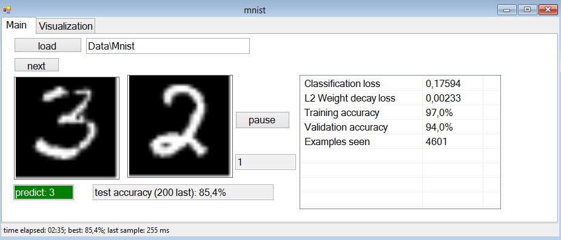
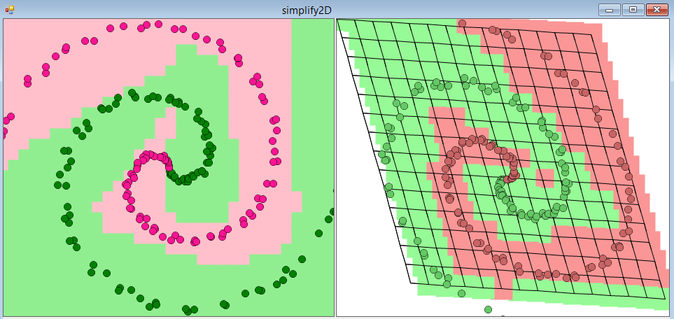
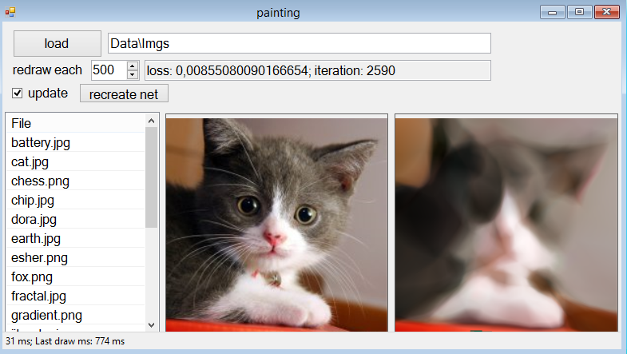

# ConvNetPort
ConvNet C# Port of ConvNetJs (https://github.com/karpathy/convnetjs)

**Project progress: 40%**

## TO-DO
- [ ] Deep Q Learn
- [ ] Cifar
- [ ] 1D
- [ ] Autoencoder
- [ ] SGD/Adagrad/Adadelta comparing

#

